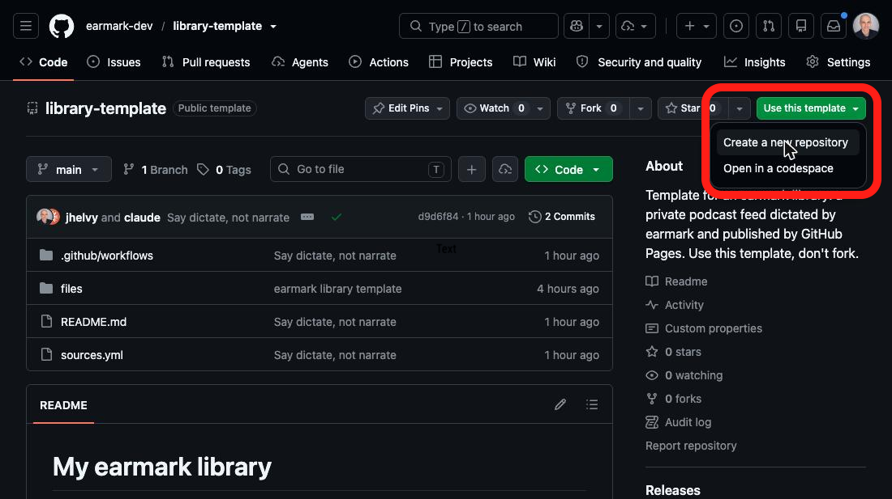
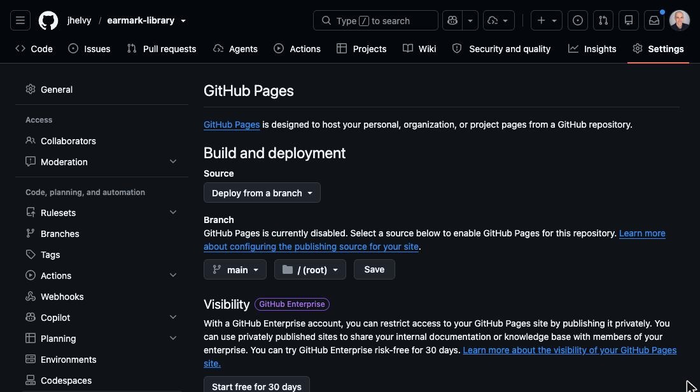
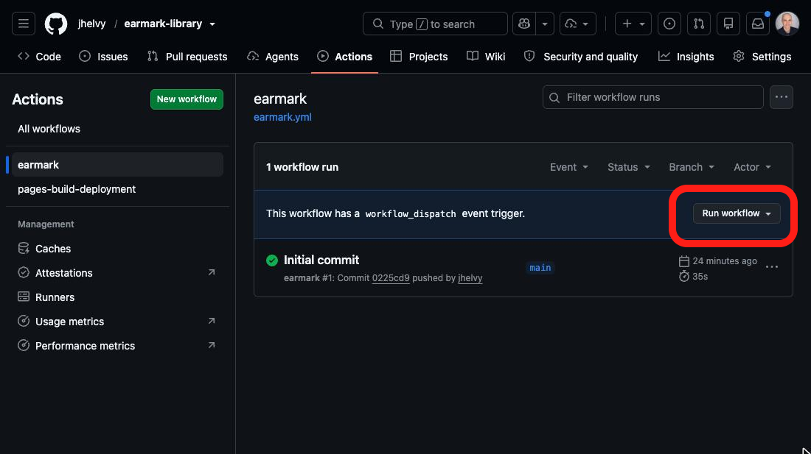
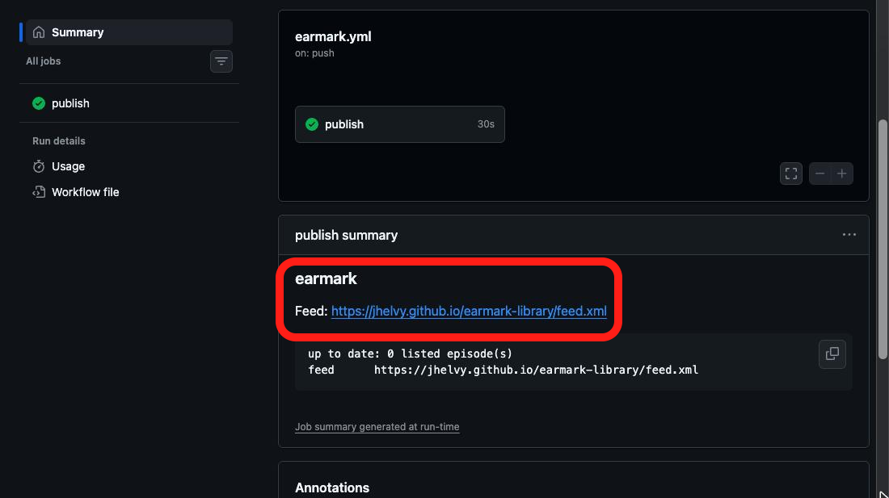

This is the easiest way to use earmark. Your library is a GitHub repo. You list
what you want to hear in one file, `sources.yml`. When you commit a change to
that file, earmark dictates the new entries and updates your podcast feed.

You need a free GitHub account. You do not install anything, you do not pay for
a sync service, and you do not run any commands. You set it up once, in four
steps.

## 1. Make your repo from the template

Open
[**earmark-dev/library-template**](https://github.com/earmark-dev/library-template)
and click **Use this template → Create a new repository**. Give the repo a
name and make it **public**.

{fig-alt="The library-template repo on GitHub, with the Use this template menu open and Create a new repository highlighted."}

## 2. Turn on GitHub Pages

In your new repo, open **Settings → Pages**. Set *Source* to **Deploy from a
branch**, branch `main`, folder `/ (root)`, then click **Save**.

{fig-alt="The Pages settings of the new repo: Source is Deploy from a branch, the branch is main and the folder is root."}

## 3. Check that the first run finished

Making the repo started a first run by itself. It creates the library settings
and an empty feed, and takes about a minute. Open the **Actions** tab and
select **earmark** on the left. The run shows a green check when it is done.

If there is no run, click **Run workflow → Run workflow** to start one.

{fig-alt="The Actions tab with the earmark workflow selected, showing one finished run named Initial commit."}

## 4. Copy your feed URL

Click the finished run, then scroll down to **publish summary**. It shows your feed URL, which looks like
`https://<you>.github.io/<repo>/feed.xml`.

{fig-alt="The summary of a finished earmark run, showing the feed URL."}

Next, [subscribe to that URL](03-subscribe.qmd) in your podcast app, then
[add something](02-add.qmd) to listen to.

## Use the Action in another repo

The template is one workflow file that calls the earmark Action. You can add
the same file to any repo:

```yaml
# .github/workflows/earmark.yml
on:
  push:
    paths: [sources.yml, "files/**", "audio/**", earmark.toml]
  workflow_dispatch:
permissions:
  contents: write
concurrency:
  group: earmark
jobs:
  publish:
    runs-on: ubuntu-latest
    steps:
      - uses: actions/checkout@v6
      - uses: earmark-dev/earmark@v1
        # with:
        #   base-url: https://audio.example.com   # for a custom domain
        #   title: My Reading Pile
```

`base-url` and `title` apply only to the first run. After that, change them in
`earmark.toml`.
